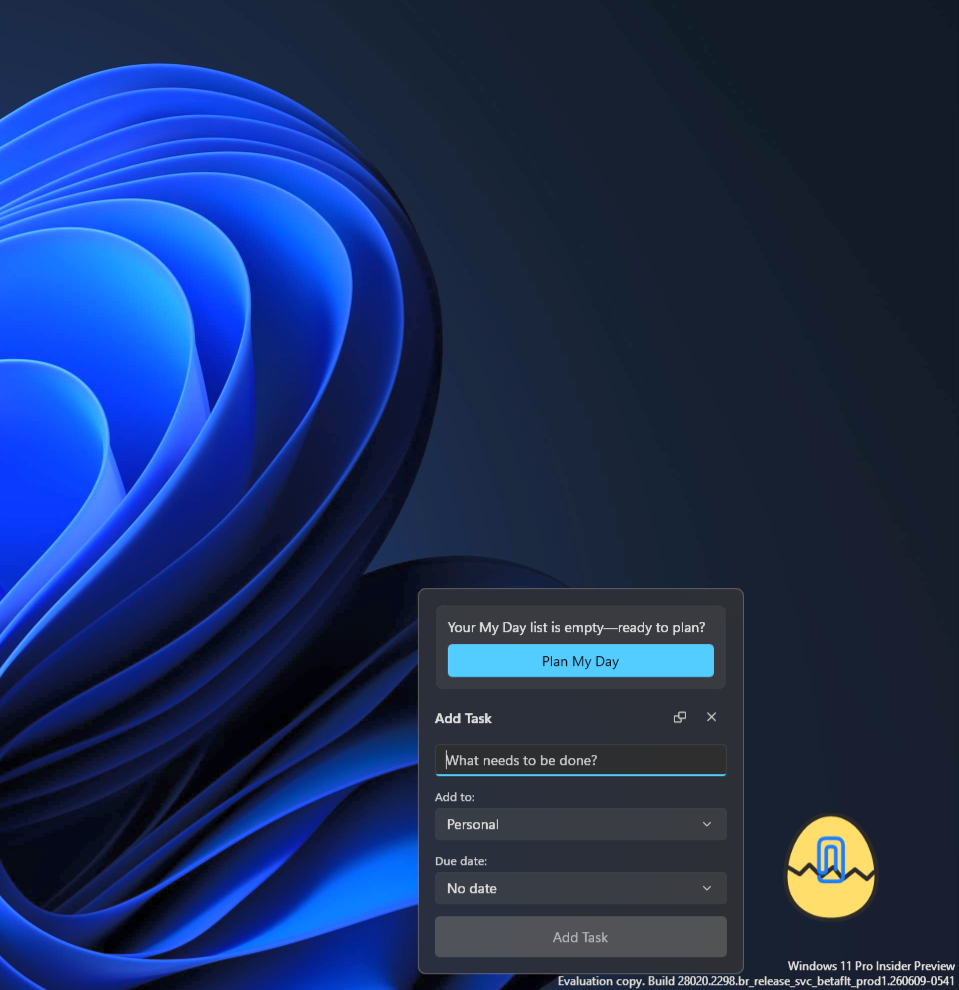
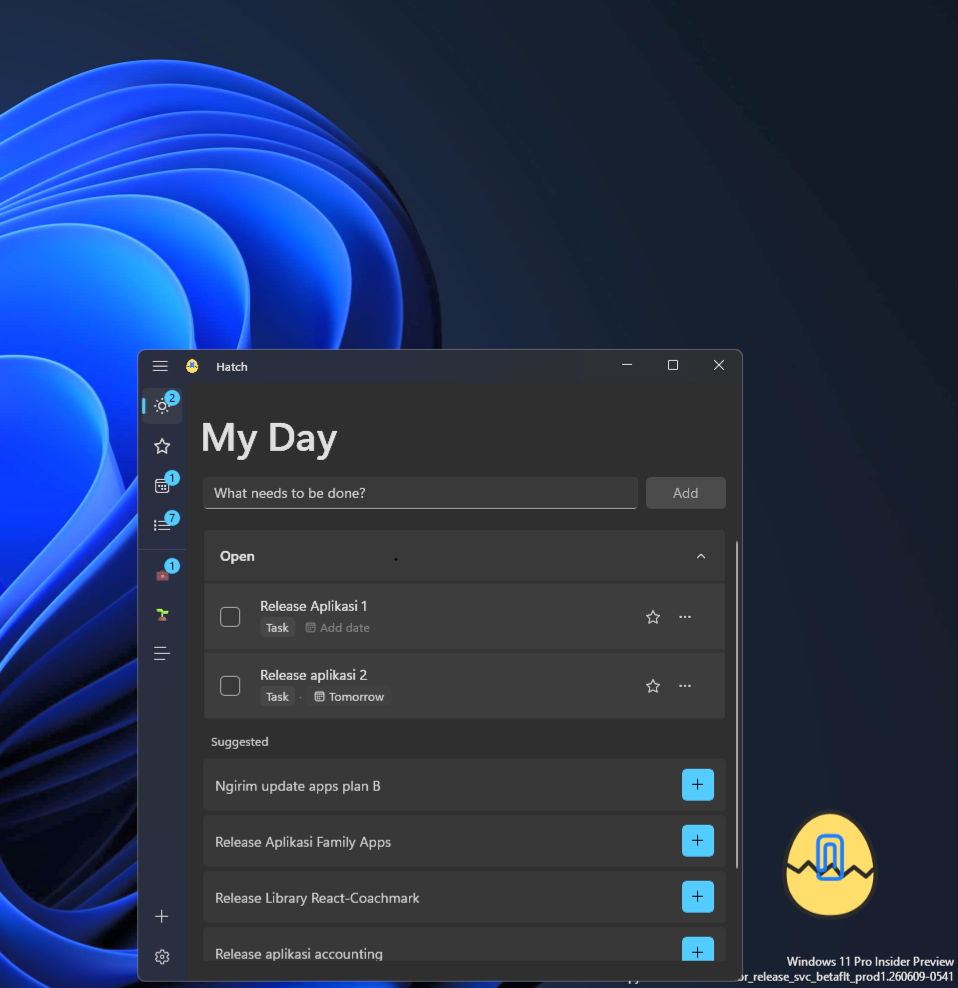
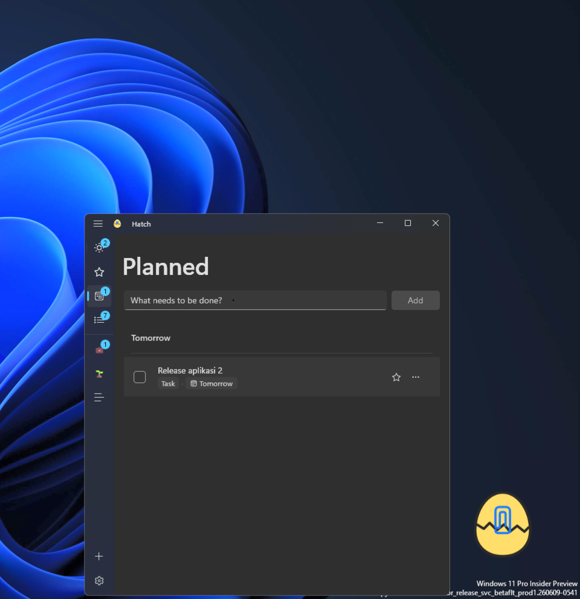
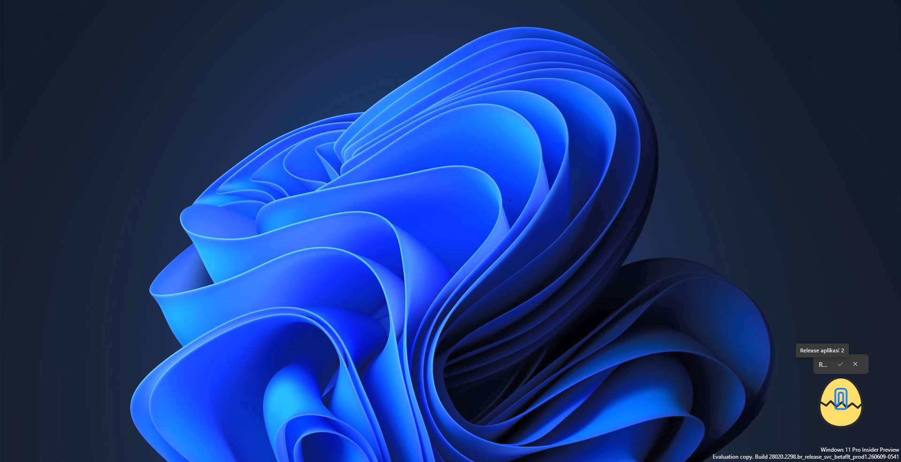
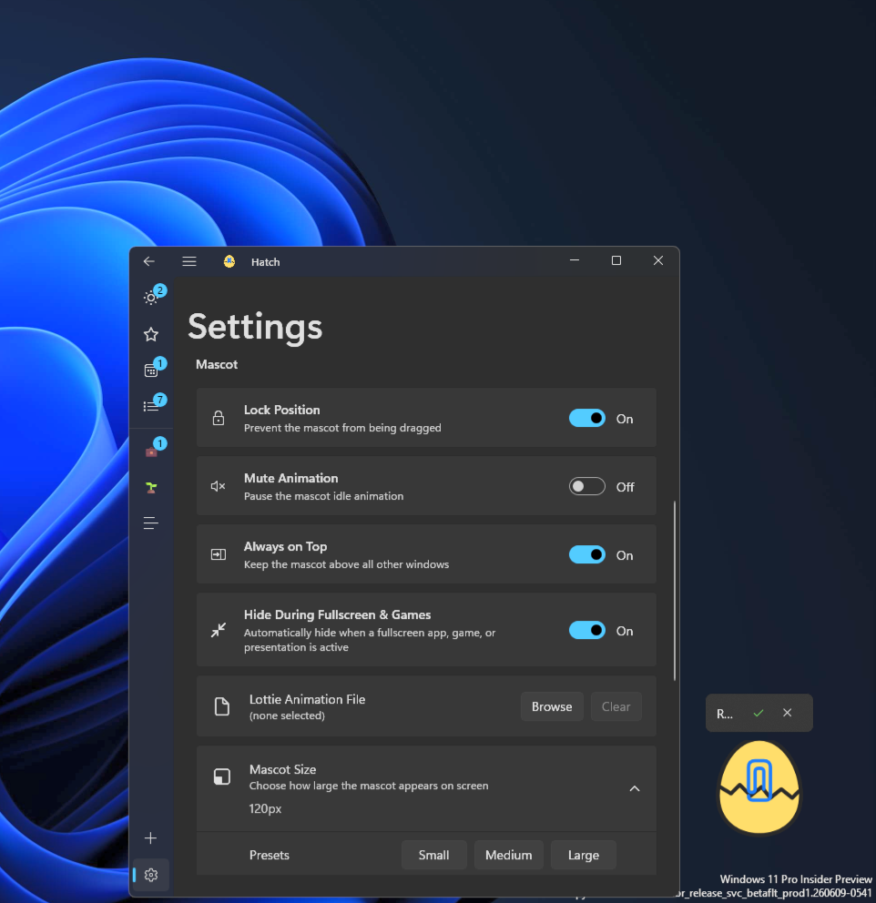

<div align="center">


# Hatch: Always-On To-Do

Your tasks, always one click away.


</div>

> A friendly always-on-top mascot lives on your desktop — capture a task in under 4 seconds, from anywhere.  
> Built with WinUI 3 for a native Windows feel. No account. No cloud. No telemetry.

---

## Features at a Glance

**Always-on-top mascot** — Click from anywhere, add a task in seconds, never leave your current app  
**Smart lists** — My Day, Important, Planned, All Tasks, unlimited custom lists  
**My Day daily reset** — Resets each morning; incomplete tasks surface as suggestions to re-add  
**Focus Mode** — Always-on-top overlay above the mascot; one task, two buttons, everything else gone  
**Due dates & reminders** — Calendar flyout with quick presets; toast notifications with Mark Complete action  
**Tags & filtering** — Free-form tags per task; click any chip to filter instantly across lists  
**Contextual tips** — Nudges based on your actual task state, never random  
**Feels right at home** — WinUI 3, Mica (Win11), Acrylic (Win10), Segoe UI Variable, system accent color  
**Private by design** — No mandatory account, no telemetry, no silent cloud  

---

## Screenshots

<!-- SCREENSHOT 1: Hero shot
     Mascot sitting on desktop with the quick-add bubble open.
     Show a real wallpaper behind it so the always-on-top effect is clear.
     Replace the line below with:  -->
> 📸 *Screenshot 1 — mascot on desktop with quick-add bubble open*

<!-- SCREENSHOT 2: Main window — My Day
     Main window open, My Day list with several tasks, details pane open on the right.
     Replace with:  -->
> 📸 *Screenshot 2 — My Day list with details pane*

<!-- SCREENSHOT 3: Planned list
     Planned list showing tasks with due-date chips (overdue, today, upcoming).
     Replace with:  -->
> 📸 *Screenshot 3 — Planned list with due-date chips*

<!-- SCREENSHOT 4: Focus Mode
     Focus Mode overlay floating above the mascot on the desktop.
     Replace with:  -->
> 📸 *Screenshot 4 — Focus Mode above the mascot*

<!-- SCREENSHOT 5: Settings
     Settings page showing theme toggle and privacy section.
     Replace with:  -->
> 📸 *Screenshot 5 — Settings page*

---

## Installation

### Microsoft Store *(recommended)*

No certificate setup needed — get it directly from the Store.

### Direct download *(sideload)*

1. Download `install-cert.cer` from [Releases](../../releases) → double-click → **Install Certificate** → **Local Machine** → **Trusted People** → **Finish** *(first time only)*
2. Download `Hatch_x.x.x.x_bundle.msixbundle` — Windows picks the right architecture automatically
3. Double-click to install — Hatch starts automatically

Subsequent releases don't need the certificate step again.

### Building from Source

**Requirements:** Windows 10 (build 17763+) or Windows 11, Visual Studio 2022 with Windows App SDK workload (or .NET 10 SDK + Windows App SDK)

```powershell
git clone https://github.com/fbtwitter/hatch.git
cd hatch
dotnet build              # Debug
dotnet build -c Release   # Release
dotnet run                # Run (Windows only)
```

Placeholder assets generate automatically. See [Contributing Guide](.github/CONTRIBUTING.md#building-from-source) for details.

---

## Privacy Guarantee

**Three rules. Non-negotiable.**

**No mandatory account** — Installs and runs with zero sign-in (optional sync available)  
**No silent cloud** — All data in `%LocalAppData%\Hatch\` by default — nothing leaves without your consent  
**No telemetry** — No analytics, no crash reports, no usage pings  

Fully functional with the network cable unplugged. Export or delete all your data in one click from Settings.

[Full privacy details →](.github/PRIVACY.md)

---

## FAQ

**Q: Does Hatch sync with Microsoft To Do?**  
A: No Microsoft To Do integration. Hatch has optional Supabase sync (Settings → Sync) if you want cross-device access, but it's off by default and never required.

**Q: Can I use Hatch on Windows 10?**  
A: Yes. Hatch requires Windows 10 build 17763 (1809) or later. Mica backdrop is Windows 11-only; Windows 10 2004+ gets Acrylic instead.

**Q: The mascot has a faint shadow around it — how do I remove it?**  
A: Disable **Show shadows under windows** in Windows performance settings: search for *"Adjust the appearance and performance of Windows"* → uncheck **Show shadows under windows**. This cannot be suppressed per-app via any public Windows API.

**Q: Will there be an Android/iOS version?**  
A: Possibly as a read-only companion app (2027+). Desktop-first for now.

**Q: How do I back up my tasks?**  
A: Settings → Export my data. Two JSON files, yours to keep.

**Q: What if I want to delete everything?**  
A: Settings → Delete all my data. One click. Gone. No recovery.

---

[Changelog](CHANGELOG.md) · [Roadmap](.github/ROADMAP.md) · [Architecture](.github/ARCHITECTURE.md) · [Performance](.github/PERFORMANCE.md) · [Contributing](.github/CONTRIBUTING.md)
