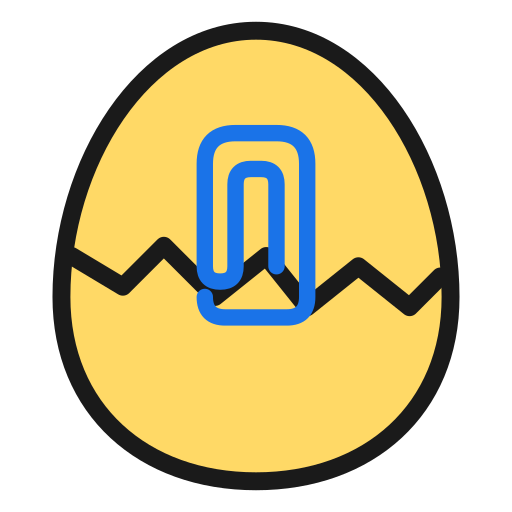

<div align="center">



# Hatch — Frictionless Task Capture for Windows 11

Fast. Private. Local-first.


</div>

> A native WinUI 3 desktop app with a friendly always-on-top eggclip mascot.  
> Capture tasks in ≤4 seconds from anywhere. No account. No cloud. No telemetry.

---

## 🚀 Get Started in 30 Seconds

**Download** the latest `.msix` from [Releases](../../releases) → **Double-click** → **Done** ✨

First time? [Install the signing cert](../../releases) (one step, one time).

[📥 Download Latest Release](../../releases) • [🏗️ Build from Source](#building-from-source) • [📝 What's New](CHANGELOG.md) • [🗺️ Roadmap](docs/ROADMAP.md)

---

## 🎯 Why Hatch?

| | **Microsoft To Do** | **Hatch** |
|---|---|---|
| **Account required** | ✅ Microsoft account | ❌ Never |
| **Task capture speed** | 3+ clicks | ⚡ ≤4 seconds |
| **Privacy** | ☁️ Syncs to servers | 🔒 Local disk only |
| **Windows 11 design** | Pre-Fluent 2 | 💎 Native WinUI 3 |
| **Personality** | Corporate | 🥚 Mascot + contextual tips |

---

## ✨ Features at a Glance

🎯 **Always-on-top mascot** — Click from anywhere, add task in seconds  
📋 **Smart lists** — My Day, Important, Planned, All Tasks, custom lists  
🔔 **Contextual tips** — Tips based on your actual task state (v0.3+)  
⚙️ **Local storage** — `%LocalAppData%` only, nothing ever leaves your device  
🎨 **Windows 11 native** — Mica, Acrylic, Segoe UI Variable, dark/light mode  
🔒 **Private by design** — No account, no cloud, no telemetry, ever  
🎪 **Appreciation cosmetics** — Optional $5 one-time purchase (skins, sounds, themes)  

---

## 📦 Installation

### Windows Package (Recommended)

1. Download the latest `.msix` from [Releases](../../releases)
2. **First time only** — Download `install-cert.cer`, double-click, select **Install Certificate** → **Local Machine** → **Trusted People** → **Finish**
3. Double-click the `.msix` file
4. Hatch starts automatically ✨

Subsequent releases don't need the cert step.

### Building from Source

**Requirements:** Windows 11, Visual Studio 2022 with Windows App SDK workload (or .NET 10 SDK + Windows App SDK)

```powershell
git clone https://github.com/fbtwitter/todo-winui3.git
cd todo-winui3
dotnet build              # Debug
dotnet build -c Release   # Release
dotnet run                # Run (Windows only)
```

Placeholder assets generate automatically. See [Contributing Guide](docs/CONTRIBUTING.md#building-from-source) for details.

---

## 📚 Documentation

| Document | Purpose |
|----------|---------|
| **[📝 Changelog](CHANGELOG.md)** | Detailed release history, what shipped in each version |
| **[🗺️ Roadmap](docs/ROADMAP.md)** | v1.0 planned features, Next, Later, decision-making process |
| **[🏗️ Architecture](docs/ARCHITECTURE.md)** | Tech stack, folder structure, data model, MVVM patterns |
| **[🔒 Privacy](docs/PRIVACY.md)** | Data guarantee, storage locations, no-network promise |
| **[📊 Performance](docs/PERFORMANCE.md)** | Memory budgets, optimization techniques, benchmarks |
| **[🤝 Contributing](docs/CONTRIBUTING.md)** | How to build, code standards, submitting PRs |

---

## 🔒 Privacy Guarantee

**Three rules. Non-negotiable.**

✅ **No account** — Installs and runs with zero sign-in  
✅ **No cloud** — All data in `%LocalAppData%\Hatch\` — nothing leaves your device  
✅ **No telemetry** — No analytics, no crash reports, no usage pings  

Fully functional with the network cable unplugged.

**Data:** Two files, plain JSON, human-readable.  
| File | Contents |
|------|----------|
| `tasks.json` | Your tasks + custom lists |
| `settings.json` | Theme, mascot position, preferences |

[Full privacy details →](docs/PRIVACY.md)

---

## ⚡ Performance

Hatch lives on your desktop permanently. Memory is a first-class constraint.

| Scenario | Target |
|----------|--------|
| Mascot idle, window closed | <50 MB |
| Main window open | <100 MB |
| Cold start → visible | <1.5s |
| MSIX install size | <30 MB |

**Optimizations:** 5s fullscreen polling, 30s hide-restore timer, aggressive memory cleanup, Lottie animations pause when hidden.

[Performance details & benchmarks →](docs/PERFORMANCE.md)

---

## 🛣️ What's Shipped

Latest releases have been moving fast. Latest production version is **v0.5.0** (June 3, 2026).

| Version | Shipped | Highlights |
|---------|---------|-----------|
| **v0.5.0** | Jun 3  | Keyboard shortcuts: Delete task, Ctrl+D due date, Ctrl+M My Day, ↑/↓ navigation, Ctrl+Enter exit notes |
| **v0.4.1** | Jun 3  | List reordering via Move up / Move down context menu; SymbolIcon on all list menu items |
| **v0.4.0** | May 22 | Details pane with inline title edit, notes, My Day toggle, due date; native ListView selection with accent highlight |
| **v0.3.1** | May 15 | Completed task grouping with collapsible Expander, 250ms animated move, undo snackbar |
| **v0.3.0** | May 12 | Contextual tip engine, adaptive silence, actionable tips, dynamic bubble sizing |
| **v0.2.6** | May 12 | Run at startup toggle, mascot auto-launch on OS boot, responsive UI |
| **v0.2.5** | May 12 | Memory optimization (<50MB idle), CPU reduction (80% less fullscreen polling) |
| **v0.2.4** | May | Manual mascot resizing with presets + custom slider |
| **v0.2.3** | May 11 | Theme-aware colors, 2x high-DPI icons, dark/light mode polish |
| **v0.2.2** | May | Mascot mute, hide-for-an-hour, first-run onboarding |
| **v0.2.1** | May 10 | Quick-add bubble, due-date presets, confirmation |
| **v0.2.0** | May 9 | NavigationView rail, smart lists (My Day, Important, Planned) |
| **v0.1.0** | May 7 | Always-on-top mascot, drag/reposition, idle animation |
| **v0.0.1** | May 1 | Initial release: tasks, settings, system tray |

[Full changelog with detailed release notes →](CHANGELOG.md)

---

## 🗺️ Roadmap

### v1.0 — Q3 2026

Core features: contextual tips, details pane, due-date picker, custom lists, privacy onboarding, appreciation cosmetics.

**v0.4.x — shipped:**
- ~~Details pane — slide-in panel with notes, My Day toggle, due date, created-at~~ ✅
- ~~List CRUD — create / rename / pin / custom icon / delete custom lists~~ ✅
- ~~List reordering — Move up / Move down via context menu~~ ✅

**v0.5.0 — shipped:**
- ~~Keyboard shortcuts: Delete, Ctrl+D, Ctrl+M, ↑/↓, Ctrl+Enter~~ ✅

**Planned:**
- Privacy first-run onboarding screen
- Appreciation purchase ($5, cosmetics only)

### Next (Post-v1.0)

Keyboard shortcuts, toast notifications, focus mode.

### Later

Cloud sync (optional, privacy-respecting), task dependencies, custom skins, time tracking.

[Full roadmap with timelines →](docs/ROADMAP.md)

---

## 🤝 Contributing

Want to help? We'd love it!

1. Read [Coding Standards](context/coding-standards.md) (non-negotiable)
2. Check [Architecture](docs/ARCHITECTURE.md) for design decisions
3. See [Contributing Guide](docs/CONTRIBUTING.md) for build steps, PR process, code review checklist

**Branch naming:** `feature/name`, `fix/name`, `chore/name`  
**Commits:** Conventional format (`feat:`, `fix:`, etc.)  
**Memory:** Every PR must note memory impact

---

## ❓ FAQ

**Q: Does Hatch sync with Microsoft To Do?**  
A: No. Hatch is local-only by design. No sync, no cloud, no integration.

**Q: Can I use Hatch without Windows 11?**  
A: No. It's WinUI 3, requires Windows 11 build 22000+.

**Q: Will there be an Android/iOS version?**  
A: Possibly as a read-only companion app (2027+). Desktop-first for now.

**Q: How do I back up my tasks?**  
A: Settings → Export my data. Two JSON files, yours to keep.

**Q: What if I want to delete everything?**  
A: Settings → Delete all my data. One click. Gone. No recovery.

---

## 📄 License

MIT License — See [LICENSE](LICENSE) file.

---

<div align="center">


**Built with ❤️ for Windows 11. No account. No cloud. No compromise.**

[⬆ Back to top](#hatch--frictionless-task-capture-for-windows-11)

</div>
