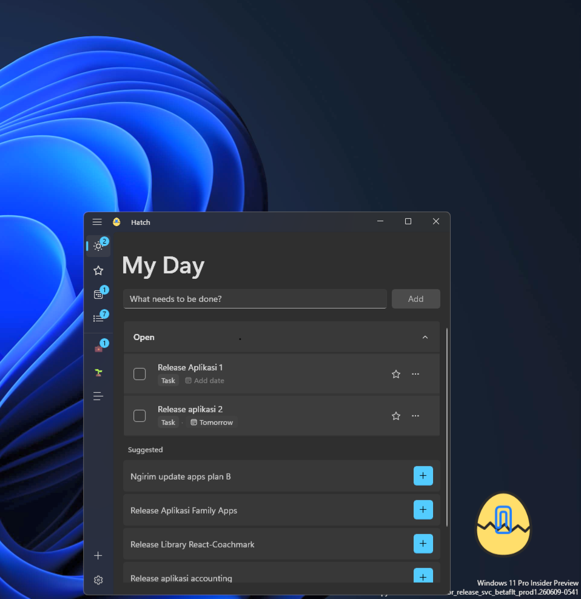

<div align="center">
  
  <h1>Hatch</h1>
  <p>A local-first Windows to-do app with an always-on-top mascot for quick task capture.</p>
  <p>
    
    
    
    
  </p>
  <p>
    <a href="https://apps.microsoft.com/detail/9PKTQFG9S3K8"></a>
    <a href="https://fbtwitter.github.io/hatch/Hatch.appinstaller"></a>
    <a href="https://github.com/fbtwitter/hatch/releases"></a>
  </p>
</div>




## Features

- Capture tasks from the always-on-top desktop mascot.
- Organize work with My Day, custom lists, tags, due dates, recurrence, and checklists.
- Use Focus Mode and the Windows 11 My Day widget.
- Keep tasks on your device or enable end-to-end encrypted sync with the [Android companion](https://github.com/fbtwitter/hatch-mobile).

## Install

**Microsoft Store:** [Install Hatch](https://apps.microsoft.com/detail/9PKTQFG9S3K8). No certificate setup is needed. Store releases may lag behind GitHub releases.

**GitHub release:** For background updates, install the signing certificate from the [latest release](https://github.com/fbtwitter/hatch/releases/latest) once, then open the [App Installer feed](https://fbtwitter.github.io/hatch/Hatch.appinstaller) and select **Install**. Install the certificate to **Local Machine > Trusted People**.

## Build from source

Requirements: Windows 10 (build 17763+) or Windows 11, plus the .NET 10 SDK and Windows App SDK.

```powershell
git clone https://github.com/fbtwitter/hatch.git
cd hatch/windows
dotnet build
dotnet run
```

See the [contributing guide](.github/CONTRIBUTING.md) for setup details.

## Privacy

Tasks are stored in `%LocalAppData%\Hatch` by default. No account or internet connection is required to use Hatch. Optional sync is off until you sign in, and the app includes no analytics or crash reporting.

Read the [privacy policy](.github/PRIVACY.md).

## Troubleshooting

**Remove the shadow around the mascot:** Search Windows for **Adjust the appearance and performance of Windows**, then clear **Show shadows under windows**. Windows does not offer a per-app setting to disable this shadow.

## Project links

[Changelog](CHANGELOG.md) · [Roadmap](.github/ROADMAP.md) · [Architecture](.github/ARCHITECTURE.md) · [License](LICENSE)
